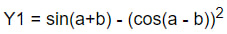
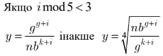
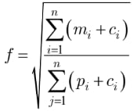

**Task:** in accordance to formula, create a program, that implements 3 algorithms and GUI for input and output. The program is written in Python using Tkinter to create the GUI.

Algorithm #1:

Algorithm #2:

Algorithm #3:

